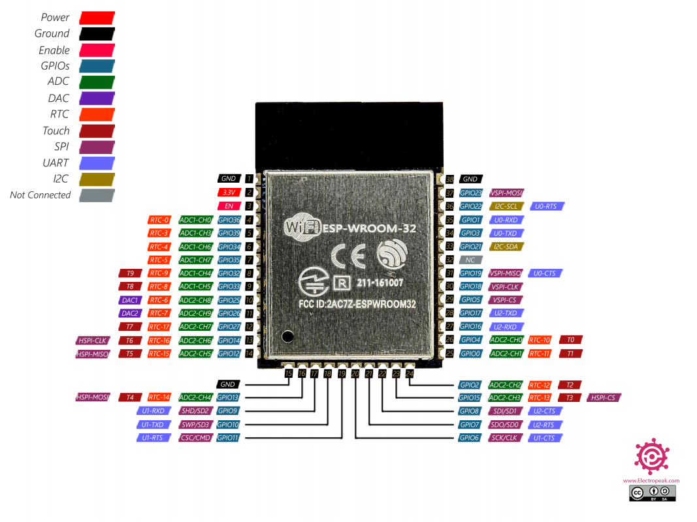

## ESTACION CAPTURA DE DATOS

* __¿en que consiste una estación?__
<pre>Una estación de captura de datos consiste en un circuito electrónico gobernado por un microcontrolador ESP32, al que se le pueden añadir distintos sensores, que se comunican con el micro mediante bus I2C.
</pre>

* __características microcontrolador ESP32__
<pre>El microcontrolador usado en el proyecto es el modelo ESP32 WROOM de la empresa Espressif, con las siguientes características:

 - CPU dual core 32 bits que puede trabajar hasta los 240Mhz
 - Alimentación entre 3.0V y 3.6V
 - Memoria SRAM de 520KB
 - Memoria flash externa de 4MB
 - Interfaz de comunicación UART, SPI, I2C, PWM, ADC, DAC
 - 32 puertos GPIO programables
 - Conexión Wi-Fi (2.4Ghz) y Bluetooth (V4.2)
</pre>

### Esquema electrónico
<pre>Cada estación se corresponde con el siguiente esquema:</pre>

### Circuito impreso
<pre>En base al esquema del punto anterior, se ha procedido al diseño de una placa de circuito impreso de doble cara, para facilitar su fabricación y permitir de una manera sencilla ajustar el contenido en una caja, con los sensores y la batería de litio: 
</pre>

### Funcionamiento de una estación
<pre>Cada estación permite varios modos de funcionamiento, dependiendo de la situación de un jumper, contemplando los siguientes escenarios:
</pre>
* __Arranque de la estación con jumper cerrado:__
<pre> En este modo, la estación funciona capturando datos en modo local y almacenándolos en la memoria flash del ESP32, por lo que no requiere acceso al router.
</pre>
* __Arranque de la estación con jumper abierto (sin archivo de log):__
<pre>Cuando al iniciar la estación se detecta que el jumper está abierto, una vez capturada la información de los sensores, se procede a conectar por wifi al router, para enviar la información capturada a través del protocolo MQTT. 
Para que la información pueda ser almacenada en B.D., es necesario que a su vez esté arrancado en el servidor la escucha de dicho protocolo, para poder así interceptar los datos de las estaciones y poder crear el nuevo registro.
</pre>
* __Arranque de la estación con jumper abierto (con archivo de log):__
<pre>Si se inicia la estación con el jumper abierto y se detecta que existe un fichero log guardado en la flash del micro, entonces la estación se conecta al router y después activa un servidor web, que permitirá la conexión desde el navegador introduciendo la IP del dispositivo, y desde allí se podrá operar con los archivos almacenados en la flash (descarga, borrado, subida de archivos y formateo de la partición de datos).
</pre>
* __Activación del modo de ahorro de energía__
<pre>Independientemente de que la captura de datos se produzca en modo local o por wifi, una vez enviada la información de los sensores, la estación pasa a modo de ahorro de energía durante un tiempo programado, en el cual la cpu pasa a modo de hibernación (DeepSleep) y se activa a su vez el modo ahorro de energía de los sensores instalados. Una vez finalizado el tiempo programado, la cpu automáticamente resetea la estación para iniciar el ciclo de nuevo. Este modo de funcionamiento es imprescindible para asegurar la autonomía de la batería, de esa manera una celda de litio 18650 de 3000 mA dispone de una autonomía de una aproximadamente una semana (con un tiempo de reinicio de unos 3 minutos).
</pre>